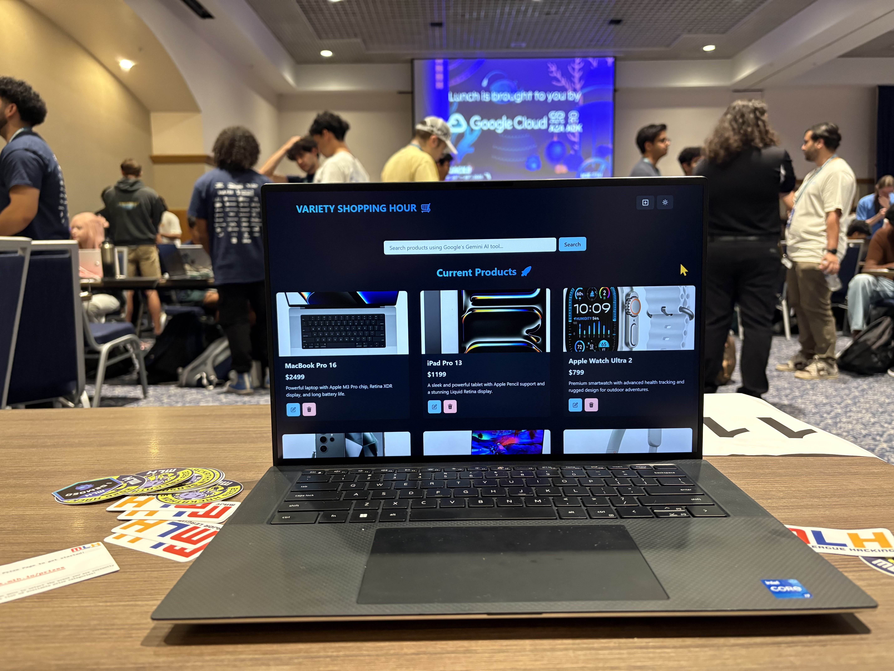
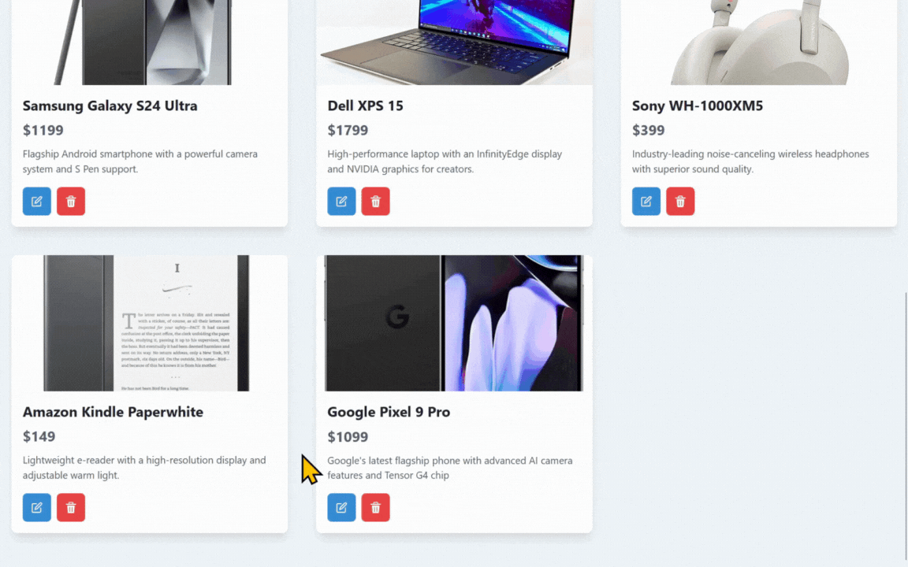
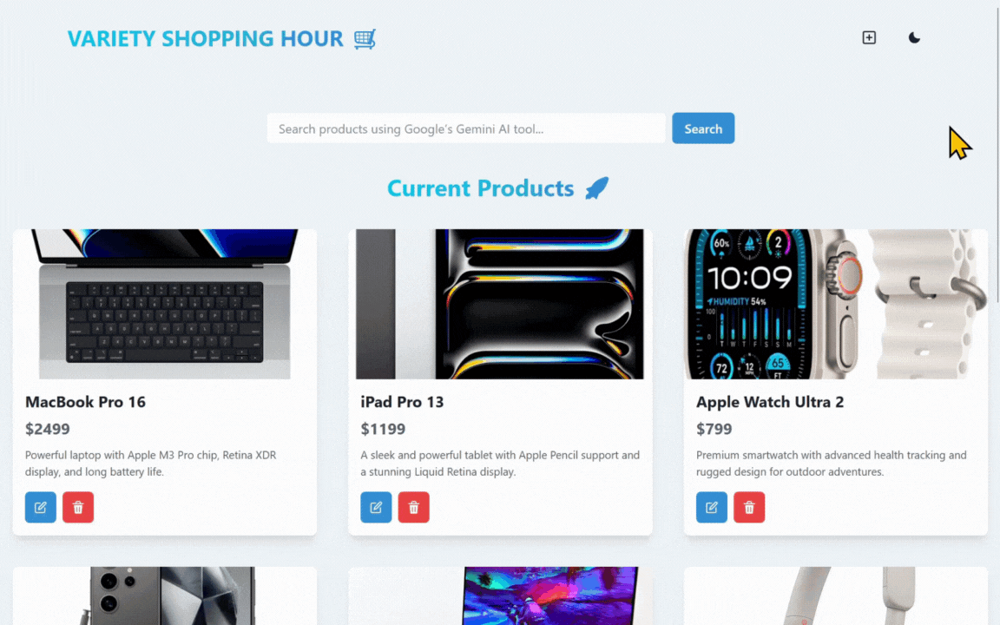

# **VarietyShoppingHour**


*("Shopping's Golden Hour finally has some variety!")*

---

## **Table of Contents**
1. [About the Project](#about-the-project)  
2. [Features](#features)    
3. [Getting Started](#getting-started)  
4. [License](#license)  
5. [Team](#team)
6. [Acknowledgements](#acknowledgments)

---

## **About the Project**
This project is a hackathon-built wishlist app in which you can organize shopping items with the help of Gemini AI validation—a tool we put together in 36 hours at [ShellHacks 2025](https://shellhacks.net/).

---

## **Features**


*(Add entries to your wishlist)*

  
*(Update entries in your wishlist)*

  
*(Delete entries from your wishlist)*

  
*(Filter wishlist using Gemini AI)*

  
*(Make your wishlist with the lights off)*

---

## **Getting Started**

```sh
git clone https://github.com/EmptySet-Exe/VarietyShoppingHour.git
```

## *Front-End*
```sh
cd ./frontend
```

## *Back-End*
```sh
cd ./backend
```

Install dependencies:

```sh
npm i
```

[! NOTE]
You need to create a .env file that holds you MongoDB URI and BACKEND_PORT (otherwise, default 3000)

To start the app in dev mode:

```sh
npm run dev
```

For production mode:

```sh
npm start
```

---

## **License**
This project is licensed under the MIT License - see the [LICENSE](LICENSE) file for details.

---

## **Team**
**Developers**  

- GitHub:
  - [@Roberto Hogas Goras](https://github.com/rhogas)  
  - [@Shanmukha "Hershey" Harshith Karamala](https://github.com/strigoaraneo)
  - [@Ritesh Hattarki](https://github.com/riteshhattarki)  
  - [@Surpris "Jack" Mezardieu](https://github.com/EmptySet-Exe)  


---

## **Acknowledgments**: 
  We would like to thank the following individuals and resources for their contributions and inspiration:
  - **INIT**: For showcasing this project at the annual hackathon ShellHacks.
  - **University of Florida**: For providing means of travel between Gainesville and Miami to attend this event.
  - **Florida International University**: For hosting the event and providing lodging, catering, and amenities.
  - **The Sponsors**: For helping to make this event possible and presenting opportunities for career development.
  - **GitHub**: For hosting this project and enabling collaboration.  
  - **freeCodeCamp.org**: For educational tutorials that guided many of the implemented features.
  - **Stack Overflow Community**: For countless solutions and advice during development.
